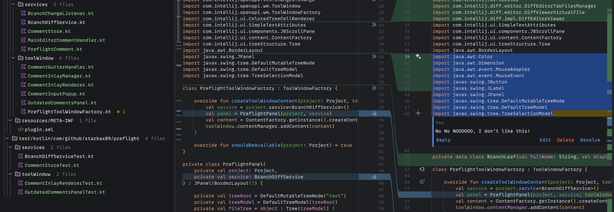

# Preflight (Local Code Review, IntelliJ Plugin)

> **Alpha** - works, has rough edges, used daily by the author.

---

## The Problem

You're working with AI agents. 
Claude builds a feature, refactors something, adds a layer. 
A few prompts later you have 300 changed lines across five files, six commits, and no idea what was actually changed.

Now, when reviewing the code, there is some paths to choose:
- push to origin and do a PR in github/azure etc.
- write comments in the code 
- write all comments donw in a file or promt, referencing the files you mean

Thats not how I want do do that. I don't want to push this slop to main to do a review and then maybe copy my comments again.
I also don't want to remove 20 Comments when I'm done.
And I don't want to reference 20 Files in a promt.

There's no good solution.
So I built one.

---

## What This Plugin Does

Leave comments directly in your editor without touching your code.

- Mark any line or block of code
- Annotate it with your thoughts, questions or concerns
- Reply to annotations, mark them as resolved
- Everything is saved locally as JSON, no server, no cloud, no account

Your codebase stays clean. Your reviews stay yours.

---


## Why Local JSON?

Because I don't want to push to some server, I don't wanted to push to origin to make a PR in github or azure, I just 
want this to be between me and the agent.

The JSON format is designed to be readable by AI agents. Hook it up to your agent, just explain the format and handover the json.
(Claude code PLUGIN in planning)
---

## Installation

Plugin Marketplace in planning.
For now, build from source:

```bash
git clone https://github.com/forcepushdev/Preflight.git
cd Preflight
./gradlew buildPlugin
```

Then in IntelliJ: `Settings -> Plugins -> Install Plugin from Disk`

---

## Status

This is alpha software. It works, I use it every day, but expect rough edges.
Updates may and WILL break your comments.

Known issues:
- Branch switching can cause annotation offsets
- Line numbers shift when code changes after annotations are added

---

## Roadmap

- [ ] Better branch switching support
- [ ] Claude Code Plugin
- [ ] IntelliJ Marketplace Plugin
- [ ] VS Code Extension

---

## Contributing

Found a bug? Have an idea? 
Open an issue or a PR, this is early and feedback shapes where it goes.

---

## Why I Built This

I vibe-coded this plugin. Never built an IntelliJ plugin before, had no idea how, asked Claude and just went for it.

The irony isn't lost on me. I built a review tool to for my production code by vibe coding XD.


<!-- Plugin description -->
Review your AI Agents changes locally.


This specific section is a source for the [plugin.xml](/src/main/resources/META-INF/plugin.xml) file which will be extracted by the [Gradle](/build.gradle.kts) during the build process.

To keep everything working, do not remove `<!-- ... -->` sections.
<!-- Plugin description end -->