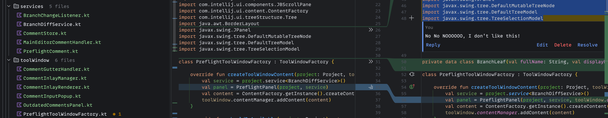

# Preflight (Local Code Review, IntelliJ Plugin)

> **Alpha**

---

## The Problem

In my current workflow, I am constantly reviewing code generated by AI agents.
But reviewing the code without pushing it to a remote repo and having a PR is kind of a pain.
You have to leave comments in the code you have to remove later, or you have to write everything into a promt.

This is why I created Preflight, a local code review tool.

The comments are stored into a local JSON file your agent can read and respond to.
No push needed.

---

## What This Plugin Does

Leave comments directly in your editor without touching your code (except the .comments.json file).

- Mark any line or block of code
- Annotate it with your thoughts, questions or concerns
- Reply to annotations, mark them as resolved
- Everything is saved locally as JSON, no server, no cloud, no account

Your codebase stays clean.

### !! You currently have to commit to be able to see the changes in Preflight !!

---

## Installation

Plugin Marketplace release planned.
For now, build from source:

```bash
git clone https://github.com/forcepushdev/Preflight.git
cd Preflight
./gradlew buildPlugin
```

Then in IntelliJ: `Settings -> Plugins -> Install Plugin from Disk`

---

## Status

This is alpha software. I use it every day but it has rough edges. Please report issues and feature requests if you find any bugs.

Known issues:

- Line numbers shift when code changes after annotations are added (this can be solved by prompting your agent to update the comments.json file with the new line numbers, but this is not automatic yet)

Currently there is no agent plugin, I use this prompt:
```
you got a new review in .preflight/comments.json, the format is
[
  {
    "id": "STABLE UUID, this is the comment's identity - use it to refer to a comment, not file/line",
    "file": "FILEPATH",
    "line": INT,
    "comment": "REVIEWER COMMENT",
    "resolved": false,
    "replies": [
      "HERE IS A REPLY, you can put your reply here. Maybe there is a conversation already "
    ],
    "startLine": INT
  }
]
startline is the line where the comment starts, endline where it ends.
line/startLine are a live snapshot kept in sync automatically while the file is edited - treat
them as informational, not as the comment's identity. Always refer to a comment by its id.
please solve the review commands, if you think the comment is wrong answer in the replies.
Replies is a list of replies {"text" :"THE TEXT", "author": "author"} use author AGENT.
When you solved the comments reply with "solved", do not set the resolved property.
do not edit line or startLine yourself, they are updated automatically.
```

---
## Plugin stuff, no NOT remove, needed for IntelliJ plugin.xml generation

<!-- Plugin description -->
Review your AI Agents changes locally.


This specific section is a source for the [plugin.xml](/src/main/resources/META-INF/plugin.xml) file which will be extracted by the [Gradle](/build.gradle.kts) during the build process.

To keep everything working, do not remove `<!-- ... -->` sections.
<!-- Plugin description end -->
